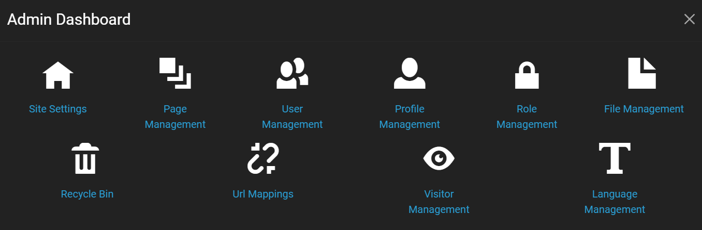
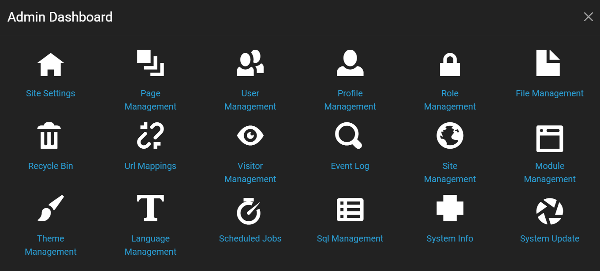

# Admin Dashboard

To view the Admin Dashboard, do the following. 

1. Log into an account as an [Administrator](../site-administration/role-management.html). 
2. Use the [top navigation](./index.html) to select the gear icon in the top right of the page. This should bring up the Control Panel.
3. From the Control Panel, click the Admin Dashboard button at the top to bring up the Admin Dashboard window, as shown below. 

Alternatively, instead of steps 2 and 3, you can open the URL https://example.com/admin, where you should replace https://example.com with the URL of *your* website. 

The Admin Dashboard displays icons for different administration tools. The icons for the Site Adminstration role are a subset of the icons displayed for the Host Administration role. 

### Site Administrator

Admin Dashboard for the Site Administrator

The default tools available for a Site Administrator include the following. 

* **[Site Settings](../site-administration/site-settings.md)** - Sets the website name, logo, favicon, theme, SMTP host, progressive web app settings, and more.
* **[Page Management](../site-administration/page-management.md)** - Lists all the website pages and offers add, edit, and delete capabilities.  
* **[User Management](../site-administration/user-management.md)** - Lists all the website users and offers add, edit, delete, and role setting capabilities, a global search function, and editable user profiles. 
* **[Profile Management](../site-administration/profile-management.md)** - Specifies custom fields for the user profiles.
* **[Role Management](../site-administration/role-management.md)** - Specifies custom roles and role permissions for creating and editing pages and modules. 
* **[File Management](../site-administration/file-management.md)** - Offers folder add and edit capabilities. Offers file upload, delete and edit capabilities. 
* **[Recycle Bin](../site-administration/recycle-bin.md)** - Offers features similar to the recycle bin on a desktop operating system. Used for deleted pages and modules. 
* **[Url Mappings](../site-administration/url-mappings.md)** - Displays a list of mapped URLs or broken URLs.
* **[Visitor Management](../site-administration/visitor-management)** - Displays records of login metadata for all website visitors.
* **[Language Management](../site-administration/language-management)** - Manages language translations used on pages of the site.

### Host Administrator

Admin Dashboard for the Host Administrator

In addition to the tools shown for the Site Administrator, the default Admin Panel for a Host Administrator displays the following tools. 

* **[Event Log](../host-administration/event-log.md)** - Displays a log of major website events, filterable by information level (trace, debug, error, etc.) and event type (create, read, update, etc.)
* **[Site Management](../host-administration/site-management.md)** - Displays a list of current sites and offers the ability to add new sites or edit sites for this Oqtane instance. 
* **[Module Management](../host-administration/module-management.md)** - Displays a list of all installed modules with edit capabilities. Offers the ability to install or create new modules.
* **[Theme Management](../host-administration/theme-management.md)** - Displays a list of all installed themes with edit capabilities. Offers the ability to install or create new themes.
* **[Scheduled Jobs](../host-administration/scheduled-jobs.md)** - Displays a list of all scheduled jobs and offers edit, view, and stop capabilities.
* **[Sql Management](../host-administration/sql-management.md)** - Provides the ability to execute SQL queries against the database of the installed websites.
* **[System Info](../host-administration/system-info.md)** - Provides read-only metadata about the system hosting Oqtane. Offers the ability to set values for logging, notification, error detail levels, and more. 
* **[System Update](../host-administration/system-update.md)** - Provides the ability to install the latest system updates for this Oqtane instance. 

If you want to add new options to the admin dashboard, then that can be done by creating a new page either in the [control panel](../admin-navigation/control-page.html) or in the admin dashboard's [page management](page-management.html) and specifying that you want "Admin" as the parent of the new page.
