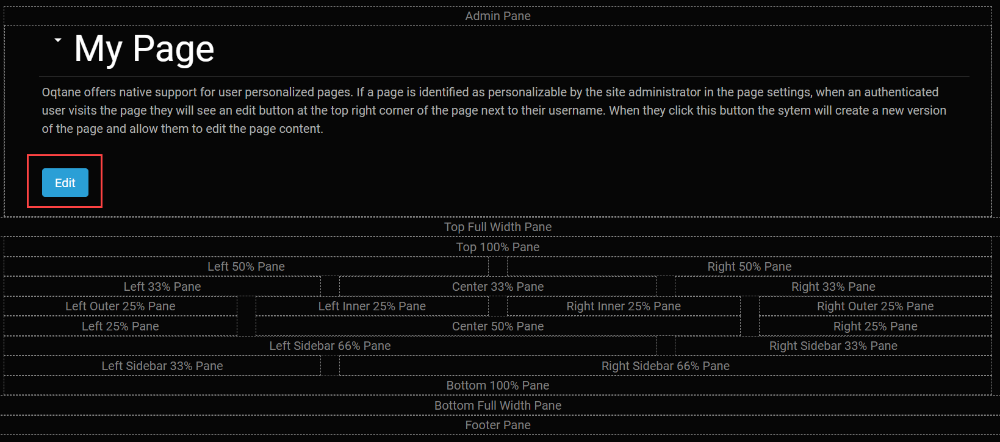

# Editing a Single Page

You can edit the page you are viewing if you are an [Administrator or Content Editor](../site-administration/role-management.html). On the upper right corner of the page, you should find a pencil icon. By clicking on the pencil icon, you can edit the content of the current page. This provides a very user-friendly and intuitive approach to managing content. Whenever you want to edit content in Oqtane, just go to the location where the content resides and edit it right there in place.

There are different aspects to editing the current page. First of all, there are some common features that are available to all modules on a page. The common features are described below under the headings of Managing Modules and Moving Modules. 

Each module on the page may also have other features for editing as well. For example, the [HTML Editor Module](../modules/htmledit-module.html) is commonly used on pages and includes an Edit button, as highlighted in red in the screenshot below. Notice that the screenshot also displays a reminder for the locations of the available panes when placing modules on a page. The available panes are determined by the template that is used for this page. 

 

### Managing Modules

If you are in edit mode and modules have been placed on a page, then you can view a module drop-down menu for each of the modules. Select the small downward pointing arrow in the top left of the module to display a drop-down menu that allows you to perform a variety of operations, as shown in the screenshot below. 

The first 5 options in the module drop-down menu are described below. 

* **Manage Settings** - Brings up the module's settings and permissions which allow you to change the following.
    * **Title** - The title displayed above the module.
    * **Container** - Specify if you want the title to be displayed for the module.
    * **Display on All Pages** - Choose whether you want this module to be on every page on the site.
    * **Page** - Change the page that the module is displayed on.
    * **Permissions** - Specify either what [roles](../site-administration/role-management.md) or individual users should be able to view or edit the page.
* **Unpublish Module** - Hides the module from everyone but the site administrators for instances where you want to edit modules.
* **Delete Module** - Deletes the module from the page.
* **Import Content** - Enter a file's address to import it into the module, such as a image address to include it.
* **Export Content** - Enter a file address to select where to export data from a module.

### Moving Modules

The next set of options in the module drop-down menu may be different depending on the location of the module in the template. These possible options are described below. 

* **Move to Top** - Moves the modules to the top of the page so that it is the first module displayed.
* **Move Up** - Moves the module up once so that it is displayed above the module above it.
* **Move Down** - Move the module down once so that it is displayed below the module beneath it.
* **Move to Bottom** - Moves the module to the bottom of the page, below all other modules.

If the page has the layout for multiple panes, which allows for three center rows and a top and bottom row that can have content inserted into them, then there will be additional options available which are described below. 

* **Move to Top Pane** - Moves the module to the content pane at the top of the page.
* **Move to Left Pane** - Moves the module to the left-most column.
* **Move to Right Pane** - Moves the module to the right-most column.
* **Move to Content Pane** - Moves the module to the central column.
* **Move to Bottom Pane** - Moves the module to the pane at the bottom of the page.

