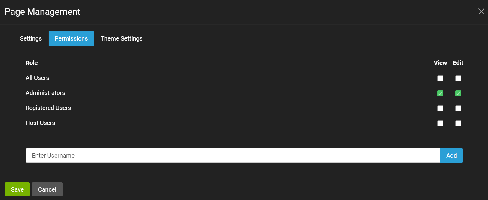

# Single Page Settings

You can configure the page settings for a given page when you create a new page or edit the page settings, for example from the Edit button in the [control panel](../admin-navigation/control-panel.html). 

The page settings include the page metadata, appearance, permissions, and theme. 

### Page Metadata and Appearance Settings

The metadata and appearance settings are the default tab displayed for the single page settings, as show in the screenshot below. 

The metadata settings for a given page are described below. 

* **Name** - Name of the page as displayed in the menu link
* **Parent** - Parent page. If there is no parent, then <Site Root> is used and name is displayed in top level of menu. If a parent is used, then the page link is a child of the parent in the menu. 
* **Insert** - Where the page link should be placed relative to other items in the menu. If the page has already been created, then this label is **Move** instead of **Insert**. 
* **Navigation** - Set whether the page is part of the navigation or not, i.e., whether it has a page link or not.
* **Clickable** - Set whether the page link in the site navigation is enabled or disabled.
* **Url Path** - Optionally enter a custom URL path to be used for this page. If this is blank, then the page name will be used.  If the page is intended to have the root path, use '/'.
* **Redirect** - Optional URL that can be used for redirection from this page URL to the redirection URL.

The appearance settings for a given page are available by slecting the drop-down caret to the right of the Appearance label. The fields for Appearance are described below. 

* **Title** - This is the title that will be used for the page. If this is left blank, then the page name will be used. 
* **Meta** - Optional meta tag values that will be displayed in the page header. The text should be entered exactly how it should appear in the page output. 
* **Theme** - The theme that should be used for this page. Each page can have its own theme. 
* **Default Container** - Select the default container for the page. 
* **Icon** - Optionally provide an icon class name for this page which will be displayed in the site navigation.
* **Personalizable** - Select whether users will be able to personalize this page with their own content.

### Page Permissions

The page permission settings are the second tab displayed, as show in the screenshot below. 

As can be seen in the screenshot, View and Edit permissions can be set for this page using a [role](../site-administration/role-management.html) or for a given user. 

### Page Theme Settings

The page theme settings are the third tab displayed, as show in the screenshot below. 

The theme settings for a given page are described below. 

* **Setting Scope** - Whether the setting scope is for the page or the entire site.
* **Show Login** - Specify if a login option should be displayed. If the login link is not displayed, login will still be accessible from a direct URL.
* **Show Register** - Specify if a register option should be displayed. If the register link is not displayed, registration will still be accessible from a direct URL. This is also dependent on the Allow Registration option in Site Settings. 
* **Display Fixed Footer** - Specify if a Footer pane should always be displayed in a fixed location at the bottom of the page. 

