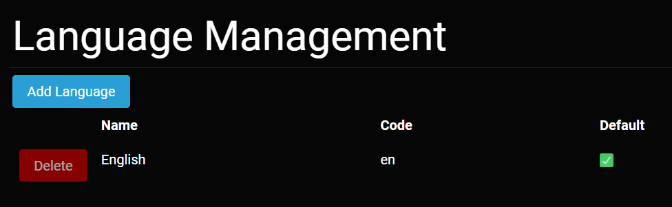

# Language Management

The Language Management screen can be accessed from the appropriate icon on the [Admin Dashboard](../admin-navigation/admin-dashboard/html) or directly from the URL https://example.com/admin/languages, where you replace https://example.com with the URL of *your* website. The Language Management screen below shows the default English language option. 

Language Management Screen

### Adding Languages
Administrators can add additional languages for the site. At the top of the Language Management Screen is the *Add Langauge* button. Clicking the *Add Language* button will display another screen where you can Manage, Download, and Upload language pack files. 

Language Download Screen

