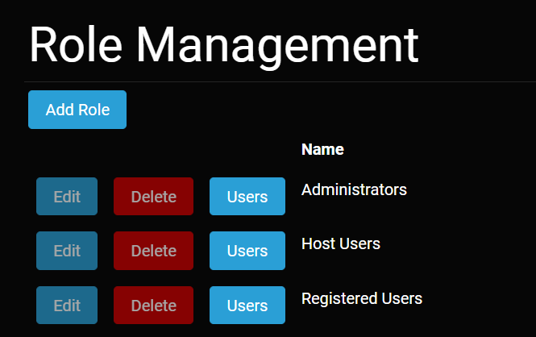

# Role Management

The Role Management screen can be accessed from the appropriate icon on the [Admin Dashboard](../admin-navigation/admin-dashboard/html) or directly from the URL https://example.com/admin/roles, where you replace https://example.com with the URL of *your* website. The Role Management screen below shows the three default security roles - - *Administrators*, *Host Users*, and *Registered Users*. 

Role Management Screen

These roles correspond to a **Site Administrator**, **Host Administrator**, or a **Registered User**, as explained below. You cannot edit or delete these roles, which is why their buttons are shown as disabled in the Role Management Screen. You can only manage the users assigned to these roles. 

### Custom Security Roles
Administrators can create a custom security role if it doesn't already exist. At the top of the Role Management Screen is the *Add Role* button. Clicking the *Add Role* button will prompt you for the addition of a new custom role with a name, description, and whether it should be automatically assigned to users. 

### How Users Are Referred To in This Documentation
In order to maintain consistency and to minimize any confusion with the value used for the roles (*Host Users*, *Administrators*, and *Registered Users*), we refer in this documentation to users according to their set of permissions. The sets of permission are described below. 

* **Host Administrator** - A site user who has the *Host Users* role. The Host Administrator has the most powerful set of permissions and is meant for manging the instance of Oqtane as a whole. The Host Administrator can edit all Oqtane host settings as well as any of the site settings within the Oqtane instance and any of the pages within the Oqtane instance. The actions that a Host Administrator takes are under the Host Administration section. 
* **Site Administrator** - A site user who has the *Administrators* role. The Site Administrator can edit all of the site settings for the site where it is given the *Administrators* role. The Site Administrator can also edit any of the pages within the site where it has the *Administrators* role. The actions that a Site Administrator takes are under the Site Administration section.

* **Administrators** - Refers to a user who has either the Host Administrator or Site Administrator level of permissions. When setting permissions for page viewing and editing, both Host Administrators and Site Administrators are grouped together as Administrators. In this documentation, when referring to Administrators, we are referring to those with either the Host Administration or the Site Administration set of permissions. 

* **Registered User** - Refers to a site user who has been given the *Registered User* role. By default, this role does not have any special permissions, and by default it is not automatically assigned to a new user. However, as is the case for all roles, it can be used for setting permissions for managing pages and modules. 

* **Content Editor** - Refers to a site user who has permissions to edit the content of a given page or extend the page with a module. Note that this permission for a page can be assigned to either a custom role or to an individual user. 

### Assigning and Using Security Roles
From the [User Management](./user-management.html) screen, an Administrator can assign a role to a user. 

The security roles can be used in different ways according to the needs of your website. For [pages](../pages/index.html), roles can determine whether a page or groups of pages can be viewed or edited. For [modules](../modules/index.html), a role can determine whether the module can be seen or not when adding a module to a page or whether content of a given module can be edited. In general, security roles can be used for content management, content editing, and hiding sections of your site.

Security roles work in a similar way to most permissions-based systems, for example Windows. You can assign users to one or more of the default or custom security roles. You can apply a role to the management or editing of pages or modules.

The screenshot below shows checkboxes for setting [permissions for a page](../pages/page-settings.html). Setting permissions for a module is similar. The checkboxes determine which roles can edit or view a page or module. In addition, the bottom textbox allows the user to assign permissions to a certain user. 

 
